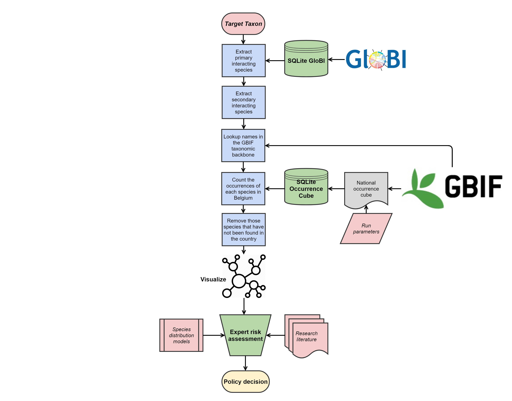
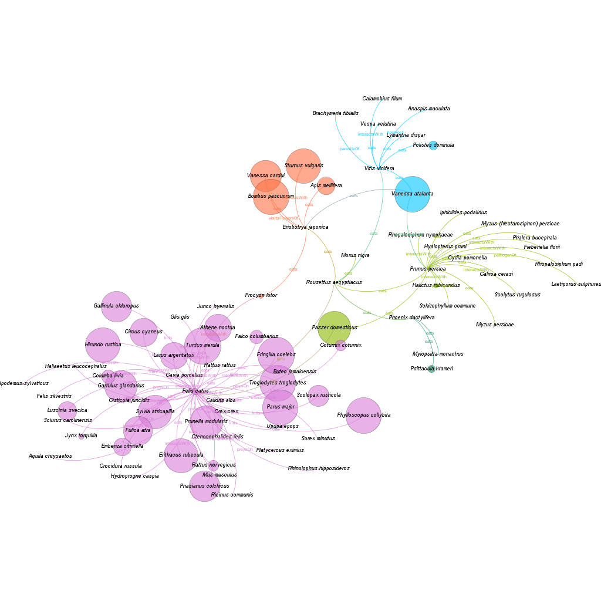

# Interactias
## A Jupyter notebook to extract and study species interation data for alien species

## Example outputs
* *[Procambarus clarkii](https://agentschapplantentuinmeise.github.io/interactias/docs/Procambarus%20clarkiiBelgium.html)*
* *[Muntiacus reevesi](https://agentschapplantentuinmeise.github.io/interactias/docs/Muntiacus%20reevesiBelgium.html)*
* *[Threskiornis aethiopicus](https://agentschapplantentuinmeise.github.io/interactias/docs/Threskiornis%20aethiopicusBelgium.html)*
* *[Impatiens glandulifera](https://agentschapplantentuinmeise.github.io/interactias/docs/Impatiens%20glanduliferaBelgium.html)*
* *[Callosciurus erythraeus](https://agentschapplantentuinmeise.github.io/interactias/docs/Callosciurus%20erythraeus.html)*

## Methods
* The script takes a single species as input and searches for all primary interacting species on [GloBI](https://www.globalbioticinteractions.org/).
* Then it goes back to GloBI to get all the interacting species of those primary interacting species.
* The script then checks to see if all those species exist on [GBIF](https://www.gbif.org/) and it outputs a list of missing species.
* We then use a occurrence cube of species, 1km grid square and year to evaluate the 1km occupancy of each species in the country of interest.
* Any interactions that can't occur in the country are removed.
* Visualizations are then created to display the result in a way that allows exploration of the network.

The large amounts of data required for this script mean that we have used local copies of much of the data and only use the GBIF API to consult the GBIF Taxonomic Backbone.

### GloBI Data
* The latest interactions.tsv.gz file can be downloaded from GloBI at https://www.globalbioticinteractions.org/data.html or there is a published snapshot of the file on Zenodo (http://doi.org/10.5281/zenodo.3950590).
* Interactions.tsv is then made into an SQLite (https://www.sqlite.org/) database using a script. https://github.com/AgentschapPlantentuinMeise/createGlobiDB. This database can then be recreated whenever it is felt necessary to use a newer version.
### Occurrence Data
* We use a preconstructed Belgian occurrence cube built from GBIF observations following the methodology of Oldoni et al. (2020a). Occurrence cubes for Belgium and Italy are currently available online (Oldoni et al. 2020b). http://doi.org/10.5281/zenodo.3637911
* To create your own occurrence cube instructions are available in Oldoni et al. (2020a) and all code is available on GitHub (https://github.com/trias-project/occ-cube).
* To query the occurrence cube it is then made into an SQLite (https://www.sqlite.org/) database using a script. https://github.com/AgentschapPlantentuinMeise/occcube

* These outputs can then be provided to expert risk assessors who can use them the evaluate what interactions might occur between an alien species and resident organisms, but also evaluate, to some extent, the impact of the interaction with reference to the occupancy.

Figure 1. A flow diagram to explain the script and the sources of the data. Steps after the Visualization are manual steps conducted with expert risk assessors.

Figure 2. An example of a network create by this notebook and then visualized in [Gephi](https://gephi.org/). The target species was the Egyptian fruit bat (*Rousettus aegyptiacus* (Geoffroy, 1810)) and the target country was Belgium. Egyptian fruit bat does not naturally occur in Belgium, but should they escape from a zoo it can be seen that they are unlikely to survive. Not only are their only food plants rare in Belgium, but they have a common predator, cats (*Felis catus* L.). In this illustration the node radius is proportional to the occupancy of that species in Belgium. The colours are modularity classes of the network. Although this is rather an extreme example, it illustrates how networks can be used to inform and evidence ecological understanding.

## pygbif needs to be installed

e.g. Using the Anaconda Prompt run `pip install pygbif`
